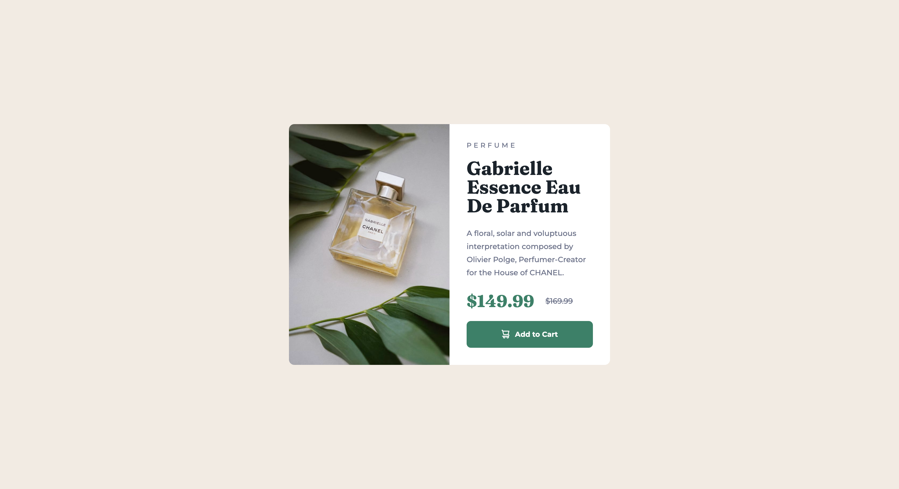

# Frontend Mentor - Product preview card component solution

This is a solution to the [Product preview card component challenge on Frontend Mentor](https://www.frontendmentor.io/challenges/product-preview-card-component-GO7UmttRfa). Frontend Mentor challenges help you improve your coding skills by building realistic projects.

## Table of contents

- [Overview](#overview)
  - [The challenge](#the-challenge)
  - [Screenshot](#screenshot)
  - [Links](#links)
- [My process](#my-process)
  - [Built with](#built-with)
  - [What I learned](#what-i-learned)
  - [Continued development](#continued-development)
- [Author](#author)

## Overview

### The challenge

Users should be able to:

- View the optimal layout depending on their device's screen size
- See hover and focus states for interactive elements

### Screenshot

### Links

- Solution URL: [https://github.com/akshaypatel99/product-card-component](https://github.com/akshaypatel99/product-card-component)
- Live Site URL: [https://akshaypatel99.github.io/product-card-component/](https://akshaypatel99.github.io/product-card-component/)

## My process

### Built with

- Semantic HTML5 markup
- CSS custom properties
- Flexbox
- Mobile-first workflow

**Note: These are just examples. Delete this note and replace the list above with your own choices**

### What I learned & Continued development

Practicing and reinforcing my knowledge of HTML and CSS.

## Author

- Website - [Akshay Patel](https://www.akshaypatel.dev)
- Frontend Mentor - [@akshaypatel99](https://www.frontendmentor.io/profile/akshaypatel99)
- Twitter - [@laidbackak](https://www.twitter.com/laidbackak)
